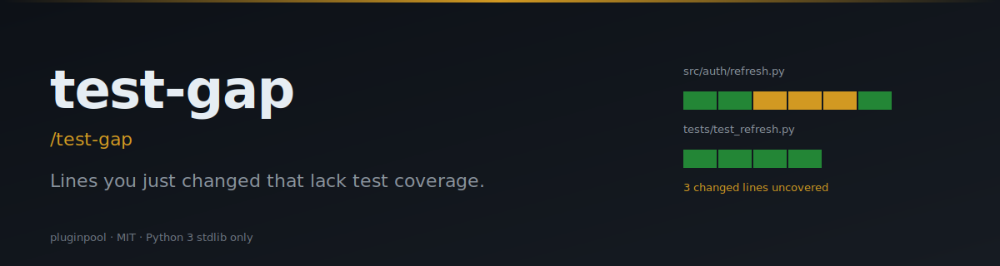

# test-gap

**Surface the lines you just changed that have zero test coverage — before the PR review does.**

[](./LICENSE)
[](https://www.python.org/)
[](https://docs.claude.com/en/docs/claude-code/overview)
[](./tests)

> **TL;DR:** `/test-gap` → markdown table of files where your diff added lines that nothing tests yet.

#### Writing

**LinkedIn**
- 🗡️ [Çift Yüzlü Katana: Yapay Zeka Dönüşümlerinin Gerçekçi Bir Analizi](https://www.linkedin.com/pulse/%C3%A7ift-y%C3%BCzl%C3%BC-katana-yapay-zeka-d%C3%B6n%C3%BC%C5%9F%C3%BCmlerinin-ger%C3%A7ek%C3%A7i-bir-mehmet-turac-80h7f) — AI transformations realistic analysis. The 5 illusions that compound into expensive, fragile systems.
- 📄 [LinkedIn Articles](https://www.linkedin.com/in/mehmetturac/recent-activity/articles/) — All published articles
- 📊 [LinkedIn Documents](https://www.linkedin.com/in/mehmetturac/recent-activity/documents/) — Research papers and technical documents

**Dev.to**
- [Why AI Agents Fail?](https://dev.to/turacthethinker/why-ai-agents-fail-ddg)
- [We Ship to Production Without Tests. Here's How It Destroyed Us.](https://dev.to/turacthethinker/we-ship-to-production-without-tests-heres-how-it-destroyed-us-i4i)
- [I built a product in one AI session. Here's the system that made it ship right.](https://dev.to/turacthethinker/i-built-a-product-in-one-ai-session-heres-the-system-that-made-it-ship-right-3mb3)
- [Remote Work Didn't Break Productivity — It Broke Human Connection](https://dev.to/turacthethinker/remote-work-didnt-break-productivity-it-broke-human-connection-288o)
- [Hermes vs OpenClaw: Which AI assistant would you actually trust?](https://dev.to/turacthethinker/hermes-vs-openclaw-which-ai-assistant-would-you-actually-trust-bbl)
- [Strategic LLM Adoption: A Director's Guide to Fine-Tuning Models](https://dev.to/turacthethinker/strategic-llm-adoption-a-directors-guide-to-fine-tuning-models-for-domain-specific-applications-4e37)
- [The Context Window Lie: Why Your LLM Remembers Nothing](https://dev.to/turacthethinker/the-context-window-lie-why-your-llm-remembers-nothing-5h1p)
- [Stop Your AI Agent From Building Tools That Already Exist](https://dev.to/turacthethinker/stop-your-ai-agent-from-building-tools-that-already-exist-6o9)
- [Why Versioned SQL Beats Vector RAG for Agent Memory Systems](https://dev.to/turacthethinker/why-versioned-sql-beats-vector-rag-for-agent-memory-systems-1jo3)
- [I Got Access to 136 AI Models for Free — NVIDIA NIM API Deep Dive](https://dev.to/turacthethinker/i-got-access-to-136-ai-models-for-free-nvidia-nim-api-deep-dive-111o)
- [Your Agent Isn't Reflecting. It's Performing Reflection.](https://dev.to/turacthethinker/your-agent-isnt-reflecting-its-performing-reflection-b41)
- [How I Stopped My AI Agent From Reinventing the Wheel](https://dev.to/turacthethinker/how-i-stopped-my-ai-agent-from-reinventing-the-wheel-24eo)


#### Writing

- ✍️ [**Dev.to · TuracTheThinker**](https://dev.to/turacthethinker) — Technical articles on AI, agentic systems, and production engineering
- 📄 [**LinkedIn Articles**](https://www.linkedin.com/in/mehmetturac/recent-activity/articles/) — Industry insights and analysis
- 📊 [**LinkedIn Documents**](https://www.linkedin.com/in/mehmetturac/recent-activity/documents/) — Research papers and technical documents

- 🗡️ [**Çift Yüzlü Katana: Yapay Zeka Dönüşümlerinin Gerçekçi Bir Analizi**](https://www.linkedin.com/pulse/%C3%A7ift-y%C3%BCzl%C3%BC-katana-yapay-zeka-d%C3%B6n%C3%BC%C5%9F%C3%BCmlerinin-ger%C3%A7ek%C3%A7i-bir-mehmet-turac-80h7f) — AI transformations realistic analysis. The 5 illusions that compound into expensive, fragile systems. (LinkedIn, 2026)


## Install (Claude Code)

```sh
git clone https://github.com/mturac/pluginpool-test-gap ~/.claude/plugins/test-gap
```

Restart Claude Code; the slash command `/test-gap` appears.

#### Writing

- ✍️ [**Dev.to · TuracTheThinker**](https://dev.to/turacthethinker) — Technical articles on AI, agentic systems, and production engineering
- 📄 [**LinkedIn Articles**](https://www.linkedin.com/in/mehmetturac/recent-activity/articles/) — Industry insights and analysis
- 📊 [**LinkedIn Documents**](https://www.linkedin.com/in/mehmetturac/recent-activity/documents/) — Research papers and technical documents

- 🗡️ [**Çift Yüzlü Katana: Yapay Zeka Dönüşümlerinin Gerçekçi Bir Analizi**](https://www.linkedin.com/pulse/%C3%A7ift-y%C3%BCzl%C3%BC-katana-yapay-zeka-d%C3%B6n%C3%BC%C5%9F%C3%BCmlerinin-ger%C3%A7ek%C3%A7i-bir-mehmet-turac-80h7f) — AI transformations realistic analysis. The 5 illusions that compound into expensive, fragile systems. (LinkedIn, 2026)


## Quick start

```sh
# After running your test suite with coverage:
python3 -m pytest --cov --cov-report=xml         # produces coverage.xml
/test-gap                                         # in Claude Code
```

Or directly:

```sh
python3 scripts/gap.py --format md
python3 scripts/gap.py --base develop --report build/lcov.info
```

#### Writing

- ✍️ [**Dev.to · TuracTheThinker**](https://dev.to/turacthethinker) — Technical articles on AI, agentic systems, and production engineering
- 📄 [**LinkedIn Articles**](https://www.linkedin.com/in/mehmetturac/recent-activity/articles/) — Industry insights and analysis
- 📊 [**LinkedIn Documents**](https://www.linkedin.com/in/mehmetturac/recent-activity/documents/) — Research papers and technical documents

- 🗡️ [**Çift Yüzlü Katana: Yapay Zeka Dönüşümlerinin Gerçekçi Bir Analizi**](https://www.linkedin.com/pulse/%C3%A7ift-y%C3%BCzl%C3%BC-katana-yapay-zeka-d%C3%B6n%C3%BC%C5%9F%C3%BCmlerinin-ger%C3%A7ek%C3%A7i-bir-mehmet-turac-80h7f) — AI transformations realistic analysis. The 5 illusions that compound into expensive, fragile systems. (LinkedIn, 2026)


## Flags

| Flag | Default | Description |
|---|---|---|
| `--base` | `main` (falls back to `master`) | Diff against this branch |
| `--report` | auto-detect | Path to `coverage.xml`, `lcov.info`, or `coverage.json` |
| `--format` | `json` | `json` or `md` |

#### Writing

- ✍️ [**Dev.to · TuracTheThinker**](https://dev.to/turacthethinker) — Technical articles on AI, agentic systems, and production engineering
- 📄 [**LinkedIn Articles**](https://www.linkedin.com/in/mehmetturac/recent-activity/articles/) — Industry insights and analysis
- 📊 [**LinkedIn Documents**](https://www.linkedin.com/in/mehmetturac/recent-activity/documents/) — Research papers and technical documents

- 🗡️ [**Çift Yüzlü Katana: Yapay Zeka Dönüşümlerinin Gerçekçi Bir Analizi**](https://www.linkedin.com/pulse/%C3%A7ift-y%C3%BCzl%C3%BC-katana-yapay-zeka-d%C3%B6n%C3%BC%C5%9F%C3%BCmlerinin-ger%C3%A7ek%C3%A7i-bir-mehmet-turac-80h7f) — AI transformations realistic analysis. The 5 illusions that compound into expensive, fragile systems. (LinkedIn, 2026)


## Supported coverage formats

| Format | Where it comes from |
|---|---|
| Cobertura `coverage.xml` | `pytest-cov`, `pytest --cov-report=xml`, `coverage xml` |
| `lcov.info` | `jest --coverage`, `c8`, Istanbul |
| `coverage.json` | `coverage json` |

#### Writing

- ✍️ [**Dev.to · TuracTheThinker**](https://dev.to/turacthethinker) — Technical articles on AI, agentic systems, and production engineering
- 📄 [**LinkedIn Articles**](https://www.linkedin.com/in/mehmetturac/recent-activity/articles/) — Industry insights and analysis
- 📊 [**LinkedIn Documents**](https://www.linkedin.com/in/mehmetturac/recent-activity/documents/) — Research papers and technical documents

- 🗡️ [**Çift Yüzlü Katana: Yapay Zeka Dönüşümlerinin Gerçekçi Bir Analizi**](https://www.linkedin.com/pulse/%C3%A7ift-y%C3%BCzl%C3%BC-katana-yapay-zeka-d%C3%B6n%C3%BC%C5%9F%C3%BCmlerinin-ger%C3%A7ek%C3%A7i-bir-mehmet-turac-80h7f) — AI transformations realistic analysis. The 5 illusions that compound into expensive, fragile systems. (LinkedIn, 2026)


## Example output (markdown)

```
| file | changed lines | uncovered | uncovered lines |
|---|---|---|---|
| src/auth/refresh.py | 42 | 11 | 81-83, 102, 117-122 |
| src/util/parse.py | 15 | 7 | 22-28 |
```

#### Writing

- ✍️ [**Dev.to · TuracTheThinker**](https://dev.to/turacthethinker) — Technical articles on AI, agentic systems, and production engineering
- 📄 [**LinkedIn Articles**](https://www.linkedin.com/in/mehmetturac/recent-activity/articles/) — Industry insights and analysis
- 📊 [**LinkedIn Documents**](https://www.linkedin.com/in/mehmetturac/recent-activity/documents/) — Research papers and technical documents

- 🗡️ [**Çift Yüzlü Katana: Yapay Zeka Dönüşümlerinin Gerçekçi Bir Analizi**](https://www.linkedin.com/pulse/%C3%A7ift-y%C3%BCzl%C3%BC-katana-yapay-zeka-d%C3%B6n%C3%BC%C5%9F%C3%BCmlerinin-ger%C3%A7ek%C3%A7i-bir-mehmet-turac-80h7f) — AI transformations realistic analysis. The 5 illusions that compound into expensive, fragile systems. (LinkedIn, 2026)


## How it works

1. Reads `git diff --unified=0 <base>..HEAD` and collects the added line numbers per file.
2. Parses the coverage report into a `{file: {covered_lines}}` map.
3. Intersects: any added line not in the covered set is reported as a gap.
4. Sorts the table by uncovered-count descending so the worst offenders surface first.

#### Writing

- ✍️ [**Dev.to · TuracTheThinker**](https://dev.to/turacthethinker) — Technical articles on AI, agentic systems, and production engineering
- 📄 [**LinkedIn Articles**](https://www.linkedin.com/in/mehmetturac/recent-activity/articles/) — Industry insights and analysis
- 📊 [**LinkedIn Documents**](https://www.linkedin.com/in/mehmetturac/recent-activity/documents/) — Research papers and technical documents

- 🗡️ [**Çift Yüzlü Katana: Yapay Zeka Dönüşümlerinin Gerçekçi Bir Analizi**](https://www.linkedin.com/pulse/%C3%A7ift-y%C3%BCzl%C3%BC-katana-yapay-zeka-d%C3%B6n%C3%BC%C5%9F%C3%BCmlerinin-ger%C3%A7ek%C3%A7i-bir-mehmet-turac-80h7f) — AI transformations realistic analysis. The 5 illusions that compound into expensive, fragile systems. (LinkedIn, 2026)


## Limitations

- Coverage is taken at face value — it doesn't know about branch coverage or test quality.
- Cobertura paths must match diff paths; configure your runner to emit project-relative paths.
- Empty diffs and no-test repos are handled gracefully (no output).

#### Writing

- ✍️ [**Dev.to · TuracTheThinker**](https://dev.to/turacthethinker) — Technical articles on AI, agentic systems, and production engineering
- 📄 [**LinkedIn Articles**](https://www.linkedin.com/in/mehmetturac/recent-activity/articles/) — Industry insights and analysis
- 📊 [**LinkedIn Documents**](https://www.linkedin.com/in/mehmetturac/recent-activity/documents/) — Research papers and technical documents

- 🗡️ [**Çift Yüzlü Katana: Yapay Zeka Dönüşümlerinin Gerçekçi Bir Analizi**](https://www.linkedin.com/pulse/%C3%A7ift-y%C3%BCzl%C3%BC-katana-yapay-zeka-d%C3%B6n%C3%BC%C5%9F%C3%BCmlerinin-ger%C3%A7ek%C3%A7i-bir-mehmet-turac-80h7f) — AI transformations realistic analysis. The 5 illusions that compound into expensive, fragile systems. (LinkedIn, 2026)


## Examples

Step-by-step walkthroughs with real input fixtures and the helper's actual output live in [`examples/`](./examples/README.md). Three or four scenarios per plugin — from the happy path to the edge cases the test suite guards.

#### Writing

- ✍️ [**Dev.to · TuracTheThinker**](https://dev.to/turacthethinker) — Technical articles on AI, agentic systems, and production engineering
- 📄 [**LinkedIn Articles**](https://www.linkedin.com/in/mehmetturac/recent-activity/articles/) — Industry insights and analysis
- 📊 [**LinkedIn Documents**](https://www.linkedin.com/in/mehmetturac/recent-activity/documents/) — Research papers and technical documents

- 🗡️ [**Çift Yüzlü Katana: Yapay Zeka Dönüşümlerinin Gerçekçi Bir Analizi**](https://www.linkedin.com/pulse/%C3%A7ift-y%C3%BCzl%C3%BC-katana-yapay-zeka-d%C3%B6n%C3%BC%C5%9F%C3%BCmlerinin-ger%C3%A7ek%C3%A7i-bir-mehmet-turac-80h7f) — AI transformations realistic analysis. The 5 illusions that compound into expensive, fragile systems. (LinkedIn, 2026)


## Part of the pluginpool family

Ten focused Claude Code plugins for everyday productivity:
[commit-narrator](https://github.com/mturac/pluginpool-commit-narrator) ·
[pr-storyteller](https://github.com/mturac/pluginpool-pr-storyteller) ·
[test-gap](https://github.com/mturac/pluginpool-test-gap) ·
[deps-doctor](https://github.com/mturac/pluginpool-deps-doctor) ·
[env-lint](https://github.com/mturac/pluginpool-env-lint) ·
[secret-guard](https://github.com/mturac/pluginpool-secret-guard) ·
[standup-gen](https://github.com/mturac/pluginpool-standup-gen) ·
[todo-harvest](https://github.com/mturac/pluginpool-todo-harvest) ·
[flaky-detector](https://github.com/mturac/pluginpool-flaky-detector) ·
[changelog-forge](https://github.com/mturac/pluginpool-changelog-forge)

#### Writing

- ✍️ [**Dev.to · TuracTheThinker**](https://dev.to/turacthethinker) — Technical articles on AI, agentic systems, and production engineering
- 📄 [**LinkedIn Articles**](https://www.linkedin.com/in/mehmetturac/recent-activity/articles/) — Industry insights and analysis
- 📊 [**LinkedIn Documents**](https://www.linkedin.com/in/mehmetturac/recent-activity/documents/) — Research papers and technical documents

- 🗡️ [**Çift Yüzlü Katana: Yapay Zeka Dönüşümlerinin Gerçekçi Bir Analizi**](https://www.linkedin.com/pulse/%C3%A7ift-y%C3%BCzl%C3%BC-katana-yapay-zeka-d%C3%B6n%C3%BC%C5%9F%C3%BCmlerinin-ger%C3%A7ek%C3%A7i-bir-mehmet-turac-80h7f) — AI transformations realistic analysis. The 5 illusions that compound into expensive, fragile systems. (LinkedIn, 2026)


## License

MIT — see [`LICENSE`](./LICENSE). Contributions welcome.
